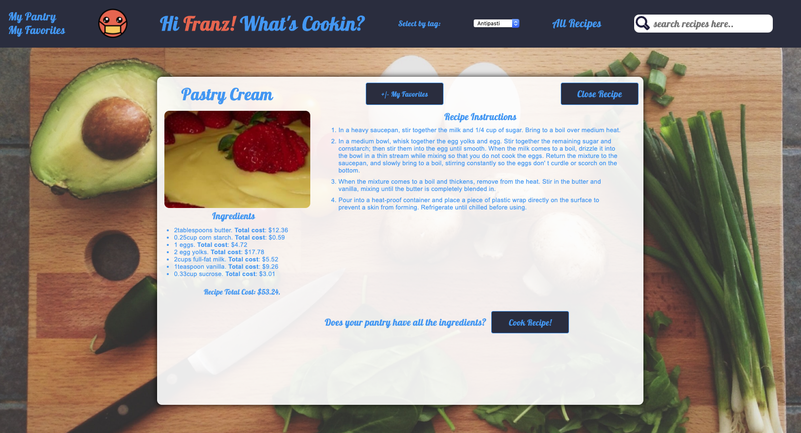
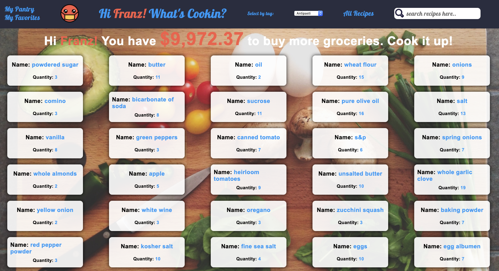

# Cooking with COVID- Your Friendly Virus

Now that you have more time at home, and all the restaurants and closed, it's time to start cooking. Welcome to Cooking with COVID. Browse tons of recipes
favorite ones you like and even check your pantry for ingredients. The App allows you to get full recipe instructions and a run down on ingredient cost for each recipe. LET'S COOK!

## Installing / Getting started

Clone down the repo. Use terminal commands to navigate to the root folder of the repo locally.

1. npm install
2. cd into src folder
3. open index.html

## Steps to use the App

1. First thing you will see when the app is loaded is the welcome banner.

2. You can search recipes by title or category.

3. When you click on a specific recipe a new window appears with ingredients and instruction details.  

4. You can check your pantry to see if you have enough ingredients to cook a chosen recipe. If you don't have enough ingredients, no problem! We give each user $10,000 to purchase ingredients. That's a real stimulus right there!

5. Store your favorite recipes in My Favorites.

### App in Action

### Technologies Used

* HTML
* CSS
* Mocha/Chai (testing)
* Vanilla JS

## Learning Goals

## Solidify and demonstrate understanding of the following:
* Testing Class Properties and Methods with Mocha/Chai
* Implement TDD
* Practice Array Prototypes
* Data Restructuring

## Challenges

The biggest challenges of this project were manipulating data, writing effective methods that produce consistent data. Another challenge was using TDD to structure classes and methods.

## Wins

The biggest win of this project was fully completing user stories and also adding extra features. Additionally we spent a lot of time setting up our data in way that made it easy to work with. We were able to complete a lot of the project requirements because we set up the data in a very usable way. 
